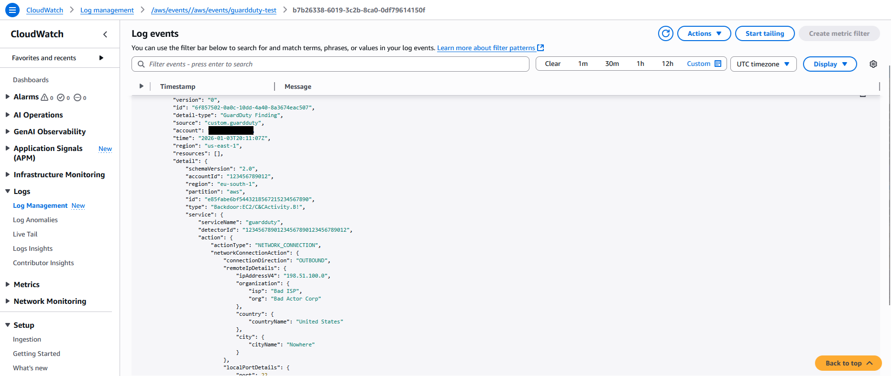
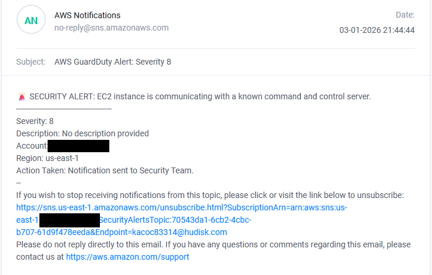

# AWS Automated Threat Response System 🛡️

  

---

## 📸 Screenshots

### 1. Event Payload

### 2. Lambda Code

### 3. Email Alert

## 🇮🇹 Versione Italiana

### 📌 Panoramica del Progetto
L'obiettivo di questo progetto era costruire una pipeline "DevSecOps" in grado di reagire agli incidenti di sicurezza in tempo reale. Invece di monitorare manualmente le dashboard, il sistema analizza gli eventi di sicurezza (schema GuardDuty) e instrada in modo intelligente gli avvisi critici al team di sicurezza.

Poiché l'account AWS Free Tier aveva limitazioni sull'attivazione di GuardDuty, ho ingegnerizzato una soluzione personalizzata per simulare minacce e testare comunque l'automazione di risposta.

**Funzionalità Chiave:**
- **Event-Driven:** Utilizza EventBridge per disaccoppiare il rilevamento dalla risposta.
- **Serverless:** Zero infrastruttura da gestire (Lambda).
- **Simulazione Custom:** Aggira i limiti del Free Tier iniettando payload GuardDuty personalizzati per il testing.
- **Filtro Intelligente:** Logica Python che filtra le segnalazioni in base alla soglia di `Severity`.

### 🏗️ Architettura
1.  **Ingestion:** EventBridge cattura gli eventi di sicurezza (Sorgente: `custom.guardduty`).
2.  **Processing:** AWS Lambda analizza il payload JSON e valuta il rischio.
3.  **Notification:** Amazon SNS invia un'email di allerta se `Severity > 4`.

### 🚀 Come Funziona (Passo dopo Passo)

**1. Simulazione Eventi (Il "Workaround")**
Ho configurato una regola EventBridge per ascoltare payload di minaccia simulati. Questo dimostra la capacità di gestire schemi di sicurezza standardizzati (JSON) indipendentemente dalla fonte.
*Pattern Evento:* `{"source": ["custom.guardduty"]}`

**2. Parsing Intelligente (Lambda)**
La funzione Lambda agisce come motore decisionale. Estrae il punteggio di gravità (`severity`) dall'oggetto JSON annidato e decide se scalare il problema.

**3. Allerta Immediata**
Le scoperte critiche attivano una notifica email istantanea via SNS, fornendo il contesto chiave (Account ID, Regione, Descrizione Minaccia) per una risposta rapida.

---

## 🇬🇧 English Version

### 📌 Project Overview
The goal of this project was to build a "DevSecOps" pipeline that reacts to security findings in real-time. Instead of manually monitoring dashboards, the system parses security events (GuardDuty findings schema) and intelligently routes critical alerts to the security team.

Due to AWS Free Tier limitations on GuardDuty activation, I engineered a custom solution to simulate threats and validate the automated response logic regardless.

**Key Features:**
- **Event-Driven:** Uses EventBridge to decouple detection from response.
- **Serverless:** Zero infrastructure to manage (Lambda).
- **Custom Simulation:** Bypasses Free Tier limitations by injecting custom GuardDuty payloads for testing.
- **Smart Filtering:** Python logic filters findings based on `Severity` threshold.

### 🏗️ Architecture
1.  **Ingestion:** EventBridge captures security events (Source: `custom.guardduty`).
2.  **Processing:** AWS Lambda parses the JSON payload and evaluates risk.
3.  **Notification:** Amazon SNS sends an email alert if `Severity > 4`.

### 🚀 How It Works (Step-by-Step)

**1. Event Simulation (The Workaround)**
I configured an EventBridge rule to listen for simulated threat payloads. This demonstrates the ability to handle standardized security schemas (JSON) regardless of the source.
*Event Pattern:* `{"source": ["custom.guardduty"]}`

**2. Intelligent Parsing (Lambda)**
The Lambda function acts as the decision engine. It extracts the `severity` score from the nested JSON object and decides whether to escalate the issue.

**3. Immediate Alerting**
Critical findings trigger an instant email notification via SNS, providing key context (Account ID, Region, Threat Description) for rapid response.

---

## 🛠️ Tech Stack
-   **Cloud Provider:** AWS
-   **Services:** Lambda (Python 3.12), EventBridge (Rules), SNS (Email).
-   **Tools:** CloudWatch Logs (Debugging).

## 📸 Screenshots
*(See `/screenshots` folder for detailed views of the EventBridge payload, Lambda code, and final Email Alert)*

---
*Created by Giuseppe*
